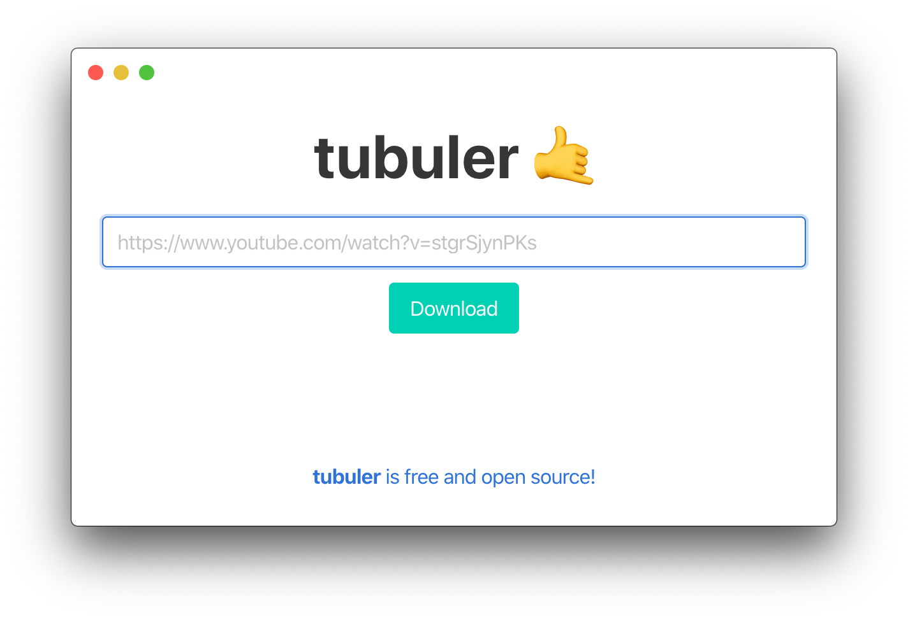

# tubuler 🤙

## What is tubuler?

tubuler is a free and open source application for downloading YouTube videos, based on the [youtube-dl](http://ytdl-org.github.io/youtube-dl/) command line tool. The application is built on [Electron](https://www.electronjs.org/) with front-end components provided by [Bulma](https://bulma.io/). Under the hood is a [Flask](https://flask.palletsprojects.com/en/1.1.x/) back-end with youtube-dl.

tubuler was built with *accessability*, *simplicity* and *openness* in mind. youtube-dl is one of many great free and open source tools out there. As a command line tool however, it poses a barier for users who might not be familiar with the CLI. tubular was made to change that.

## Requirements

* [Node.js](https://nodejs.org/en/)
* [Python 3](https://www.python.org/)

## Getting Started

1. `npm install`
2. `npm run deps`
3. `npm run babel`
4. `cp -r node_modules/bulma/css`

To start tubuler, run `npm start`.